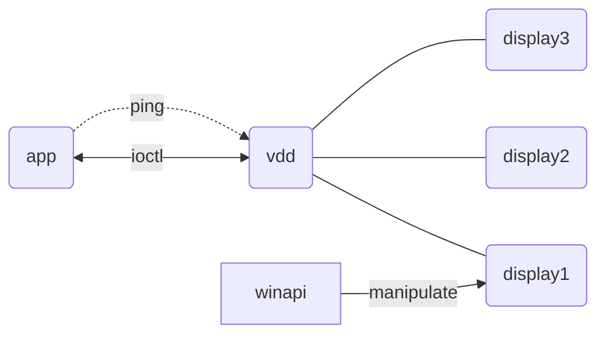

<br>

<p align="center">
  
  <h1 align="center">parsec-vdd</h1>
  <p align="center">
    ✨ Standalone <strong>Parsec Virtual Display</strong>
    <br />
    Create virtual display up to <strong>4K@240Hz</strong>
  </p>
  <p align="center">
    
    
  </p>
</p>

<br>

## ℹ About

This project provides a **standalone solution for creating virtual displays** on a Windows host using the **Parsec Virtual Display Driver** (VDD), independent of the **Parsec app**.

The Parsec VDD enables virtual displays on Windows 10+ systems, a feature available to Parsec Teams and Warp customers.
With VDD, users can add up to three virtual displays to a host machine they connect to, ideal for setups where physical monitors may be unavailable or when additional displays are beneficial.

Built by Parsec, the VDD leverages the IddCx API (Indirect Display Driver) to generate virtual displays with support for high resolutions and refresh rates, including up to 4K and 240 Hz.
This capability makes it a versatile tool for gaming, streaming, or remote work, allowing users to simulate multiple screens for an enhanced, flexible visual experience.

## 📺 ParsecVDisplay App

ParsecVDisplay is a comprehensive virtual display manager for Parsec VDD, built with C# and WPF.
The app provides an intuitive interface to manage virtual displays, showing the number of active displays and allowing users to add or remove specific virtual displays.
It also supports features like changing display resolution, capturing screenshots, and more, making it a versatile tool for flexible display management.

👉 Check out [Releases](https://github.com/nomi-san/parsec-vdd/releases) to
download it.

<p align="center">
  
</p>

## 🚀 Using Core API

### Design notes

Parsec VDD is designed to work with Parsec client-connection sessions. When the user
connects to the host, the app will start controlling the driver, it sends IO
control codes and gets results. When adding a virtual display, you will get its
index to be used for unplugging, the maximum number of displays could be added
up to 16 per adapter. You have to ping the driver periodically to keep added
displays alive, otherwise all of them will be unplugged after a second. There's
no direct way to manipulate added displays, you should call Win32 Display API to
change their display mode (see the ParsecVDisplay source).



### Using the code

- The core API is designed as single C/C++ header that can be added to any
  project, 👉 [core/parsec-vdd.h](./core/parsec-vdd.h)
- There is also a simple demo program, 👉 [core/vdd-demo.cc](./core/vdd-demo.cc)

### Picking a driver

You have to install the driver to make them work.

| Version           | Minimum OS      | IddCx | Notes                                                     |
| :---------------- | :-------------- | :---: | :-------------------------------------------------------- |
| [parsec-vdd-0.38] | Windows 10 1607 |  1.0  | Obsolete, may crash randomly.                             |
| [parsec-vdd-0.41] | Windows 10 19H2 |  1.4  | Stable.                                                   |
| [parsec-vdd-0.45] | Windows 10 21H2 |  1.5  | Better streaming color, but may not work on some Windows. |

[parsec-vdd-0.38]: https://builds.parsec.app/vdd/parsec-vdd-0.38.0.0.exe
[parsec-vdd-0.41]: https://builds.parsec.app/vdd/parsec-vdd-0.41.0.0.exe
[parsec-vdd-0.45]: https://builds.parsec.app/vdd/parsec-vdd-0.45.0.0.exe

> All of them also work on Windows Server 2019 or higher.

You can unzip (using 7z) the driver setup above to obtain the driver files and
`nefconw` CLI.

```
vdd-0.45/
  |__ nefconw.exe
  |__ driver/
    |__ mm.cat
    |__ mm.dll
    |__ mm.inf
```

Command line method to install the driver using `nefconw` (admin required):

```
start /wait .\nefconw.exe --remove-device-node --hardware-id Root\Parsec\VDA --class-guid "4D36E968-E325-11CE-BFC1-08002BE10318"
start /wait .\nefconw.exe --create-device-node --class-name Display --class-guid "4D36E968-E325-11CE-BFC1-08002BE10318" --hardware-id Root\Parsec\VDA
start /wait .\nefconw.exe --install-driver --inf-path ".\driver\mm.inf"
```

In addition, you can run the driver setup in silent mode to install it
quickly.

```
.\parsec-vdd-0.45.0.0.exe /S
```

## 😥 Known Limitations

> This list shows the known limitations of Parsec VDD.

### 1. HDR support

Parsec VDD does not support HDR on its displays (see the EDID below).
Theoretically, you can unlock support by editing the EDID, then adding HDR
metadata and setting 10-bit+ color depth. Unfortunately, you cannot flash its
firmware like a physical device, or modify the registry value.

All IDDs have their own fixed EDID block inside the driver binary to initialize
the monitor specs. So the solution is to modify this block in the driver DLL
(mm.dll), then reinstall it with `nefconw` CLI (see above).

### 2. Custom resolutions

Before connecting, the virtual display looks in the
`HKEY_LOCAL_MACHINE\SOFTWARE\Parsec\vdd` registry for additional preset
resolutions. Currently this supports a maximum of 5 values.

```
SOFTWARE\Parsec\vdd
  key: 0 -> 5 | (width, height, hz)
```

To unlock this limit, you need to patch the driver DLL the same way as above,
but **5 is enough** for personal use.

## 😑 Known Bugs

> This is a list of known issues when working with standalone Parsec VDD.

### 1. Incompatible with Parsec Privacy Mode


If you have enabled "Privacy Mode" in Parsec Host settings, please disable it
and clear the connected display configurations in the following Registry path.

```
HKEY_LOCAL_MACHINE\SYSTEM\CurrentControlSet\Control\GraphicsDrivers\Connectivity
```

This option causes your main display to turn off when virtual displays are
added, making it difficult to turn the display on and disrupting the remote
desktop session.

### 2. // todo

## 🤔 Comparison with other IDDs

The table below shows a comparison with other popular Indirect Display Driver
projects.

| Project                        | Iddcx version | Signed | Gaming | HDR |                               H-Cursor                               | Tweakable | Controller |
| :----------------------------- | :-----------: | :----: | :----: | :-: | :------------------------------------------------------------------: | :-------: | :--------: |
| [usbmmidd_v2]                  |               |   ✅   |   ❌   | ❌  |                                  ❌                                  |           |            |
| [IddSampleDriver]              |      1.2      |   ❌   |   ❌   | ❌  |                                  ❌                                  |           |            |
| [RustDeskIddDriver]            |      1.2      |   ❌   |   ❌   | ❌  |                                  ❌                                  |           |            |
| [Virtual-Display-Driver (HDR)] |     1.10      |   ❌   |        | ✅  |                                  ❌                                  |           |            |
| [virtual-display-rs]           |      1.5      |   ❌   |        | ❌  | [#81](https://github.com/MolotovCherry/virtual-display-rs/issues/81) |    ✅     |     ✅     |
| parsec-vdd                     |      1.5      |   ✅   |   ✅   | ❌  |                                  ✅                                  |    🆗     |     ✅     |

✅ - full support, 🆗 - limited support

[usbmmidd_v2]: https://www.amyuni.com/forum/viewtopic.php?t=3030
[IddSampleDriver]: https://github.com/roshkins/IddSampleDriver
[RustDeskIddDriver]: https://github.com/fufesou/RustDeskIddDriver
[virtual-display-rs]: https://github.com/MolotovCherry/virtual-display-rs
[Virtual-Display-Driver (HDR)]: https://github.com/itsmikethetech/Virtual-Display-Driver

**Signed** means that the driver files have a valid digital signature.
**H-Cursor** means hardware cursor support, without it, you will get a double
cursor on some remote desktop apps. **Tweakable** is the ability to customize
display modes. Visit
[MSDN IddCx versions](https://learn.microsoft.com/en-us/windows-hardware/drivers/display/iddcx-versions)
to check the minimum supported Windows version.

## 📘 Parsec VDD Specs

### Preset display modes

All of the following display modes are set by driver default.

| Resolution      | Common name |    Aspect ratio    |  Refresh rates (Hz)  |
| --------------- | :---------: | :----------------: | :------------------: |
| 4096 x 2160     |   DCI 4K    |  1.90:1 (256:135)  |   24/30/60/144/240   |
| 3840 x 2160     |   4K UHD    |        16:9        |   24/30/60/144/240   |
| 3840 x 1600     |  UltraWide  |       24:10        |   24/30/60/144/240   |
| 3840 x 1080     |  UltraWide  | 32:9 (2x 16:9 FHD) |   24/30/60/144/240   |
| 3440 x 1440     |             |   21.5:9 (43:18)   |   24/30/60/144/240   |
| 3240 x 2160     |             |        3:2         |          60          |
| 3200 x 1800     |     3K      |        16:9        |   24/30/60/144/240   |
| 3000 x 2000     |             |        3:2         |          60          |
| 2880 x 1800     |    2.8K     |       16:10        |          60          |
| 2880 x 1620     |    2.8K     |        16:9        |   24/30/60/144/240   |
| 2736 x 1824     |             |                    |          60          |
| 2560 x 1600     |     2K      |       16:10        |   24/30/60/144/240   |
| 2560 x 1440     |     2K      |        16:9        |   24/30/60/144/240   |
| 2560 x 1080     |  UltraWide  |        21:9        |   24/30/60/144/240   |
| 2496 x 1664     |             |                    |          60          |
| 2256 x 1504     |             |                    |          60          |
| 2048 x 1152     |             |                    |      60/144/240      |
| 1920 x 1200     |     FHD     |       16:10        |      60/144/240      |
| **1920 x 1080** |   **FHD**   |      **16:9**      | 24/30/**60**/144/240 |
| 1800 x 1200     |     FHD     |        3:2         |          60          |
| 1680 x 1050     |     HD+     |       16:10        |      60/144/240      |
| 1600 x 1200     |     HD+     |        4:3         |   24/30/60/144/240   |
| 1600 x 900      |     HD+     |        16:9        |      60/144/240      |
| 1440 x 900      |     HD      |       16:10        |      60/144/240      |
| 1366 x 768      |             |                    |      60/144/240      |
| 1280 x 800      |     HD      |       16:10        |      60/144/240      |
| 1280 x 720      |     HD      |        16:9        |      60/144/240      |

Notes:

- Low GPUs, e.g GTX 1650 may get bugged when streaming with DCI 4K.
- All resolutions are compatible with 60 Hz refresh rates.

### Adapter info

- Name: `Parsec Virtual Display Adapter`
- Hardware ID: `Root\Parsec\VDA`
- Adapter GUID: `{00b41627-04c4-429e-a26e-0265cf50c8fa}`
- Class GUID: `{4d36e968-e325-11ce-bfc1-08002be10318}`

### Monitor info

- ID: `PSCCDD0`
- Name: `ParsecVDA`
- EDID:

```
00 FF FF FF FF FF FF 00  42 63 D0 CD ED 5F 84 00
11 1E 01 04 A5 35 1E 78  3B 57 E0 A5 54 4F 9D 26
12 50 54 27 CF 00 71 4F  81 80 81 40 81 C0 81 00
95 00 B3 00 01 01 86 6F  80 A0 70 38 40 40 30 20
35 00 E0 0E 11 00 00 1A  00 00 00 FD 00 30 A5 C1
C1 29 01 0A 20 20 20 20  20 20 00 00 00 FC 00 50
61 72 73 65 63 56 44 41  0A 20 20 20 00 00 00 10
00 00 00 00 00 00 00 00  00 00 00 00 00 00 01 C6
02 03 10 00 4B 90 05 04  03 02 01 11 12 13 14 1F
8A 4D 80 A0 70 38 2C 40  30 20 35 00 E0 0E 11 00
00 1A FE 5B 80 A0 70 38  35 40 30 20 35 00 E0 0E
11 00 00 1A FC 7E 80 88  70 38 12 40 18 20 35 00
E0 0E 11 00 00 1E A4 9C  80 A0 70 38 59 40 30 20
35 00 E0 0E 11 00 00 1A  02 3A 80 18 71 38 2D 40
58 2C 45 00 E0 0E 11 00  00 1E 00 00 00 00 00 00
00 00 00 00 00 00 00 00  00 00 00 00 00 00 00 A6
```

Visit http://www.edidreader.com/ to view it online or use an advanced tool
[AW EDID Editor](https://www.analogway.com/apac/products/software-tools/aw-edid-editor/).

## 🤝 Sponsors

<table>
  <tr>
    <td></td>
    <td>Free code signing on Windows provided by <a href="https://signpath.io">SignPath.io</a>, certificate by <a href="https://signpath.org">SignPath Foundation</a></td>
  </tr>
</table>

## 🍻 Credits

- Thanks to Parsec for the driver
- The app's background was from old parsecgaming.com
