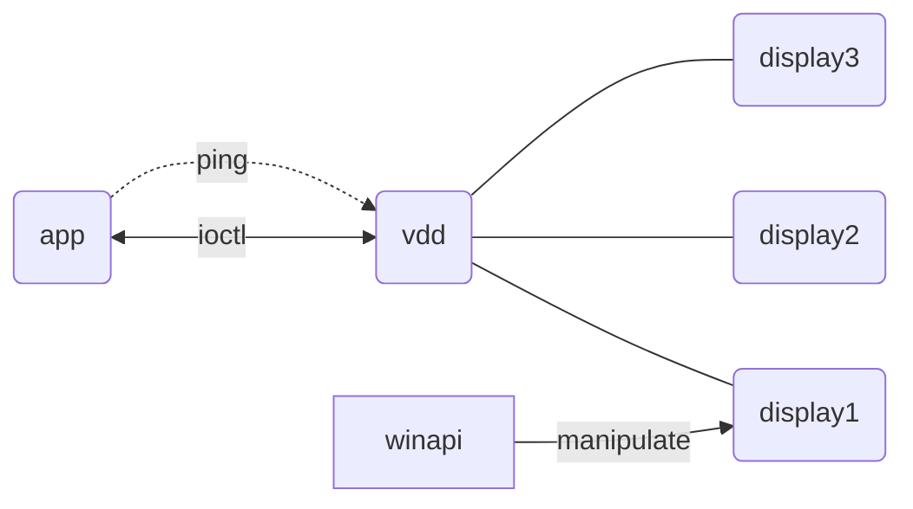

<!-- tracking -->


<p align="center">
  <picture>
    <source media="(prefers-color-scheme: dark)" srcset="https://github.com/user-attachments/assets/74e7db71-6166-49ae-b6c5-7543b15c60eb">
    
  </picture>
</p>

<p align="center">
  ✨ Perfect <strong>virtual display</strong> for game streaming
</p>

<p align="center">
  <a href="#">
    
  </a>
  <a href="https://github.com/nomi-san/parsec-vdd/releases">
    
  </a>
</p>

<br>

## ℹ About

This project provides a **standalone solution for creating virtual displays** on
a Windows host using the **Parsec Virtual Display Driver** (VDD), independent of
the **Parsec app**.

The Parsec VDD enables virtual displays on Windows 10+ systems, a feature
available to Parsec Teams and Warp customers. With VDD, users can add up to
three virtual displays to a host machine they connect to, ideal for setups where
physical monitors may be unavailable or when additional displays are beneficial.

Built by Parsec, the VDD leverages the IddCx API (Indirect Display Driver) to
generate virtual displays with support for high resolutions and refresh rates,
including up to 4K and 240 Hz. This capability makes it a versatile tool for
gaming, streaming, or remote work, allowing users to simulate multiple screens
for an enhanced, flexible visual experience.

## 📺 ParsecDisplay App

ParsecDisplay is a virtual display manager for Parsec VDD, built with C# and
WPF. It provides a tray-based interface to add and remove virtual displays,
change their resolution, refresh rate, and orientation, capture screenshots,
and more.

👉 Check out [Releases](https://github.com/nomi-san/parsec-vdd/releases) to
download it.

<p align="center">
  
</p>

## 🚀 Using Core API

### Design notes

Parsec VDD is designed to work with Parsec client-connection sessions. When
the user connects to the host, the app starts controlling the driver —
sending IO control codes and receiving results. Adding a virtual display
returns an index, used later to unplug it; up to 16 displays can be added
per adapter. The driver must be pinged periodically to keep added displays
alive, otherwise all of them will be unplugged after about a second. There
is no direct way to manipulate added displays — call the Win32 Display API
to change their display mode (see the ParsecDisplay source).


```mermaid
flowchart LR
  A(app)
  B(vdd)

  A <--->|ioctl| B
  A ..->|ping| B

  B --- X(display1)
  B --- Y(display2)
  B --- Z(display3)

  winapi -->|manipulate| X
```

### Using the code

For detailed instructions and usage examples, refer to the [VDD_LIBRARY_USAGE](./docs/VDD_LIBRARY_USAGE.md).

- The core API is designed as a single C/C++ header that can be added to any
  project, 👉 [core/parsec-vdd.h](./core/parsec-vdd.h)
- There is also a simple demo program, 👉 [core/vdd-demo.cc](./core/vdd-demo.cc)

### Picking a driver

You have to install the driver before any virtual displays can be created.

| Version           | Minimum OS      | IddCx | Notes                                                     |
| :---------------- | :-------------- | :---: | :-------------------------------------------------------- |
| [parsec-vdd-0.38] | Windows 10 1607 |  1.0  | Obsolete, may crash randomly.                             |
| [parsec-vdd-0.41] | Windows 10 19H2 |  1.4  | Stable.                                                   |
| [parsec-vdd-0.45] | Windows 10 21H2 |  1.5  | Better streaming color, but may not work on some Windows. |

[parsec-vdd-0.38]: https://builds.parsec.app/vdd/parsec-vdd-0.38.0.0.exe
[parsec-vdd-0.41]: https://builds.parsec.app/vdd/parsec-vdd-0.41.0.0.exe
[parsec-vdd-0.45]: https://builds.parsec.app/vdd/parsec-vdd-0.45.0.0.exe

> All of them also work on Windows Server 2019 or higher.

You can unzip (using 7z) the driver setup above to obtain the driver files and
`nefconw` CLI.

```
vdd-0.45/
  |__ nefconw.exe
  |__ driver/
    |__ mm.cat
    |__ mm.dll
    |__ mm.inf
```

Command line method to install the driver using `nefconw` (admin required):

```
start /wait .\nefconw.exe --remove-device-node --hardware-id Root\Parsec\VDA --class-guid "4D36E968-E325-11CE-BFC1-08002BE10318"
start /wait .\nefconw.exe --create-device-node --class-name Display --class-guid "4D36E968-E325-11CE-BFC1-08002BE10318" --hardware-id Root\Parsec\VDA
start /wait .\nefconw.exe --install-driver --inf-path ".\driver\mm.inf"
```

In addition, you can run the driver setup in silent mode to install it quickly.

```
.\parsec-vdd-0.45.0.0.exe /S
```

## 😥 Known Limitations

> This list shows the known limitations of Parsec VDD.

### 1. HDR support

Parsec VDD does not support HDR on its displays (see the EDID below).
Theoretically, you can unlock support by editing the EDID to include HDR
metadata and a 10-bit+ color depth. Unfortunately, you cannot flash its
firmware the way you would a physical monitor — there is no registry
setting to toggle either.

All IDDs have their own fixed EDID block inside the driver binary to initialize
the monitor specs. So the solution is to modify this block in the driver DLL
(mm.dll), then reinstall it with `nefconw` CLI (see above).

### 2. Custom resolutions

Before connecting, the virtual display looks in the `HKLM\SOFTWARE\Parsec\vdd`
registry for additional preset resolutions. Currently this supports a maximum
of 5 entries.

```yaml
HKLM\SOFTWARE\Parsec\vdd:
  - key: [0 -> 5]
    value: { width, height, hz }
```

To unlock this limit, you need to patch the driver DLL the same way as above,
but **5 is enough** for personal use.

## 😑 Known Bugs

> This is a list of known issues when working with standalone Parsec VDD.

### 1. Incompatible with Parsec Privacy Mode


If you have enabled "Privacy Mode" in Parsec Host settings, please disable it
and clear the connected display configurations in the following Registry path.

```
HKEY_LOCAL_MACHINE\SYSTEM\CurrentControlSet\Control\GraphicsDrivers\Connectivity
```

This option causes your main display to turn off when virtual displays are
added, making it difficult to turn the main display back on and disrupting
the remote desktop session.

### 2. Windows 10 Connectivity registry quirk

Windows 10 caches display arrangements keyed by the _combination_ of attached
display IDs. When a middle display is unplugged, the remaining subset
(e.g. `DISP001_DISP003`) is a new combo Windows hasn't seen — those displays
fall back to default mode and arrangement.

The app works around this by always unplugging **right-to-left** (latest
driver index first) during sleep, exit, and `vdd remove all`. See
[issue #23](https://github.com/nomi-san/parsec-vdd/issues/23)
for the full write-up.

### 3. Headless before user login

The app is a GUI process and requires an interactive user session (Vista+
session 0 isolation). On a freshly-booted headless host with no auto-login,
nothing runs until the user signs in. Workarounds:

- Enable auto-login on the host.
- Or use a Task Scheduler entry that runs at logon with desktop interaction.
- Or use the service-based fork
  [ParsecVDA-Always-Connected](https://github.com/timminator/ParsecVDA-Always-Connected)
  for fully headless single-display deployments.

## 🤔 Comparison with other IDDs

The table below shows a comparison with other popular Indirect Display Driver
projects.

| Project                        | Iddcx version | Signed | Gaming | HDR  | H-Cursor | Tweakable | Controller |
| :----------------------------- | :-----------: | :----: | :----: | :--: | :------: | :-------: | :--------: |
| [usbmmidd_v2]                  |      N/A      |   ✅   |   ❌   | ❌  |   ❌    |    🆗     |    ❌     |
| [IddSampleDriver]              |      1.2      |   ❌   |   🆗   | ❌  |   ❌    |    🆗     |    ❌     |
| [RustDeskIddDriver]            |      1.2      |   ❌   |   ❌   | ❌  |   ❌    |    🆗     |    ❌     |
| [Virtual-Display-Driver (HDR)] |      1.10     |   ✅   |   ✅   | ✅  |   ✅    |    ✅     |    ❌     |
| [virtual-display-rs]           |      1.5      |   ❌   |   ✅   | ❌  |   ✅    |    ✅     |    ✅     |
| parsec-vdd                     |      1.5      |   ✅   |   ✅   | ❌  |   ✅    |    🆗     |    ✅     |

✅ - full support, 🆗 - limited support

[usbmmidd_v2]: https://www.amyuni.com/forum/viewtopic.php?t=3030
[IddSampleDriver]: https://github.com/roshkins/IddSampleDriver
[RustDeskIddDriver]: https://github.com/fufesou/RustDeskIddDriver
[virtual-display-rs]: https://github.com/MolotovCherry/virtual-display-rs
[Virtual-Display-Driver (HDR)]: https://github.com/itsmikethetech/Virtual-Display-Driver

**Signed** means the driver files have a valid digital signature.
**H-Cursor** means hardware-cursor support — without it, you get a double
cursor on some remote desktop apps. **Tweakable** is the ability to customize
display modes. Visit
[MSDN IddCx versions](https://learn.microsoft.com/en-us/windows-hardware/drivers/display/iddcx-versions)
to check the minimum supported Windows version.

## 📘 Parsec VDD Specs

Common preset display modes:

| Resolution  | Common Name | Aspect Ratio | Refresh Rates (Hz) |
| ----------- | ----------- | ------------ | ------------------ |
| 3840 x 2160 | 4K UHD      | 16:9         | 24/30/60/144/240   |
| 3440 x 1440 | UltraWide   | 21.5:9       | 24/30/60/144/240   |
| 2560 x 1440 | 2K          | 16:9         | 24/30/60/144/240   |
| 2560 x 1080 | UltraWide   | 21:9         | 24/30/60/144/240   |
| 1920 x 1080 | FHD         | 16:9         | 24/30/60/144/240   |
| 1600 x 900  | HD+         | 16:9         | 60/144/240         |
| 1280 x 720  | HD          | 16:9         | 60/144/240         |

Check out [docs/PARSEC_VDD_SPECS](./docs/PARSEC_VDD_SPECS.md) for the full
list of preset display modes and driver specs.

## 🍻 Credits

- Thanks to Parsec for the driver
- The app's background was from old parsecgaming.com

<table>
  <tr>
    <td></td>
    <td>Trusted code signing on Windows provided by <a href="https://signpath.io">SignPath.io</a>, certificate by <a href="https://signpath.org">SignPath Foundation</a></td>
  </tr>
</table>
